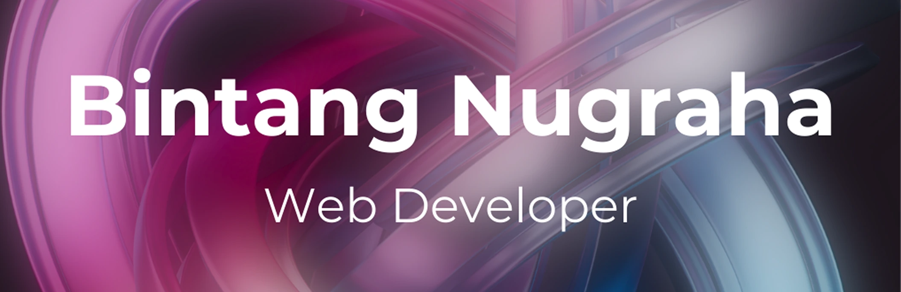

# Muhammad Bintang Nugraha – Portfolio

Personal portfolio built with [Astro](https://astro.build), [React](https://react.dev) and [Tailwind CSS](https://tailwindcss.com) to showcase my work and skills.

## Features

- Responsive layout styled with Tailwind CSS
- Interactive sections powered by React
- Projects gallery with screenshots and GitHub links
- Contact form powered by [Formspree](https://formspree.io/)

## Getting Started

```bash
npm install
npm run dev
```

Then open <http://localhost:4321> in your browser.

## Scripts

- `npm run dev` – start development server with hot reloading
- `npm run build` – type-check and generate production files
- `npm run preview` – preview the production build locally

## Project Structure

```
/
├── public/          # Static assets
├── src/
│   ├── components/  # Astro & React components
│   ├── layouts/     # Shared layouts
│   └── pages/       # Site pages
└── package.json
```

## Contact

Feel free to reach out through the contact form or via [GitHub](https://github.com/bintangnugrahaa).
